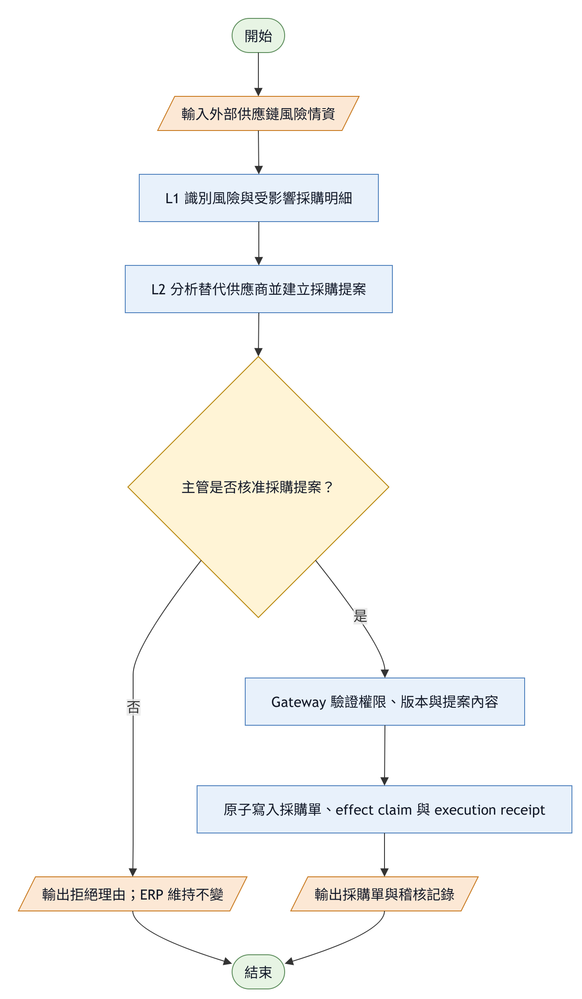
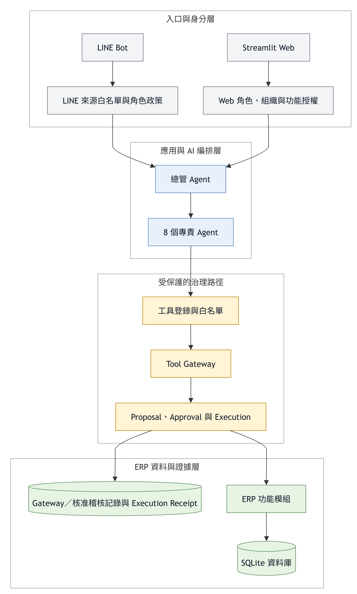

# AI-Risk-Based-Inventory-ERP

[繁體中文](README.md) | [English](README.en.md)

[](https://github.com/falltwo/AI-Risk-Based-Inventory-ERP/actions/workflows/tests.yml)
[](https://github.com/falltwo/AI-Risk-Based-Inventory-ERP/releases)


> **v1.0 — 可治理的供應鏈 AI 決策閉環**
> AI 負責判斷與提案，人類保留執行權；受保護的 AI／Gateway 採購寫入可被審批、重放與追溯。

本專案實作一套具治理控制的 AI Agent 進銷存系統，整合外部供應鏈風險、企業採購資料、AI 決策提案、人工核准與 ERP 執行。

> [!IMPORTANT]
> 本版本是競賽與研究型 PoC。它採「一個 SQLite 資料庫對應一個組織」的部署邊界，尚未提供共享資料庫的多租戶隔離、外部 IAM/SSO 或跨系統分散式交易，因此不得直接當成公開網路服務的正式身分與授權系統。

## 功能層級

| 層級 | Demo 帳號 | 提供功能 | 限制 |
|---|---|---|---|
| **L1 風險觀測** | `viewer / viewer` | 風險 KPI、熱圖、最新告警、唯讀 CSV 對映與通知預覽 | 不建立提案、不修改 ERP |
| **L2 情報與決策** | `planner / planner` | 影響分析、What-if、替代供應商比較、建立不可變 Proposal 並送審 | 不核准、不直接執行 ERP 寫入 |
| **L3 核准與執行** | `approver / approver` | 檢視核准證據、核准／拒絕、Gateway 執行、稽核時間線 | 不能核准自己的提案 |

### 採購決策流程



[draw.io 可編輯原檔](docs/diagrams/governed_procurement_flow_zh.drawio)

## v0.1 → v1.0

v1.0 在 v0.1 治理 harness 基礎上，加入 L1→L2→L3 供應鏈決策流程與分層操作介面。

| 面向 | v0.1 — Governance Harness Complete | v1.0 — Governed Decision Loop |
|---|---|---|
| 核心成果 | 關閉 Web、LINE、rollback 等治理旁路 | 將治理底座接成 L1→L2→L3 完整產品流程 |
| AI 狀態揭露 | 由程式強制揭露 pending／denied，不依賴 prompt | Proposal、Approval、Execution 分離，畫面與資料庫狀態一致 |
| 供應鏈流程 | 情資、熱圖、受影響單據與建議各自存在 | 受影響採購明細可直接形成替代採購 Proposal |
| 人工核准 | 通用寫入審批與可稽核狀態 | L3 顯示來源單據、供應商變更、數量、單價、理由與 digest |
| 執行安全 | Gateway、hash-chain log、transaction baseline | exact line/price identity、即時撤權檢查、同來源明細唯一 effect、冪等 receipt |
| 產品分層 | 角色與治理能力為主要重點 | 三個獨立帳號、三種可見功能與最小權限 |
| 自動化測試 | 55 tests（v0.1 release） | **327 passing tests**（v1.0 release verification） |
| 文件 | 中文 README 與架構圖 | 雙語 README、版本比較、適用範圍與限制、v1.0 Release notes |

v0.1 欄位根據維護者保留的封存 Release 紀錄整理；私有封存庫不列入公開文件連結。

## 治理與安全設計

- **伺服器端能力檢查**：角色、組織 membership 與 entitlement 每次從資料庫重新載入；缺值或撤權後一律 fail closed。
- **職責分離**：L2 只能提案，L3 才能決策；同一帳號即使換角色也不能核准自己的提案。
- **不可變核准證據**：canonical payload digest 覆蓋真正決定效果的欄位，並綁定來源採購明細、替代供應商價格與 operation ID。
- **原子執行**：受保護採購單在同一 SQLite transaction 內完成 CAS 狀態轉移、ERP 寫入、business-effect claim、execution receipt 與終態。
- **冪等重放**：相同 operation 重送時回傳既有 receipt，不會建立第二張採購單。
- **端到端稽核**：L2 Proposal、L3 決策與 Gateway 執行以同一 operation ID 串接；公開畫面只顯示脫敏摘要。
- **34 個受治理工具**：27 `read_only`、1 `suggestion`、6 `write`、0 `dangerous`；8 個專責 Agent 僅持有職責內白名單。

## 系統架構



[draw.io 可編輯原檔](docs/diagrams/system_architecture_zh.drawio)

治理宣稱的邊界是上圖中的受保護 AI／Gateway 採購流程。現有手動 Web ERP 表單另有角色權限控制，但並非每個手動寫入都會產生 Proposal、Approval 與 execution receipt。

## 快速開始

### 1. 安裝

```bash
git clone https://github.com/falltwo/AI-Risk-Based-Inventory-ERP.git
cd AI-Risk-Based-Inventory-ERP

python -m venv .venv
# Windows
.venv\Scripts\activate
# macOS / Linux
# source .venv/bin/activate

pip install -r requirements.txt
```

### 2. 建立本機 Demo 設定

```bash
cp .env.example .env
```

在 `.env` 至少設定：

```dotenv
ERP_DEMO_MODE=true
LLM_MODEL=gemini/gemini-2.5-flash
GEMINI_API_KEY=replace_with_your_key
```

### 3. 啟動

```bash
streamlit run app.py
```

Demo 模式才會建立並顯示 `viewer`、`planner`、`approver` 等已知測試帳密。**只能在本機展示使用，不得開放至公網。**

## 重要設定

| 環境變數 | 用途 | 預設／要求 |
|---|---|---|
| `ERP_DEMO_MODE` | 建立合成資料與 Demo 帳號 | `false`；僅限本機 |
| `ERP_ORGANIZATION_ID` | 綁定此 SQLite DB 所屬組織 | Demo 自動使用 `demo-org`；既有非 Demo DB 必須設定後再配置 membership 與 entitlement |
| `ERP_DB_PATH` | 自訂 SQLite 路徑 | `data/erp.db` |
| `LLM_MODEL` | LiteLLM 主模型 | `gemini/gemini-2.5-flash` |
| `LLM_FALLBACK_MODELS` | 逗號分隔的備援模型 | 見 `.env.example` |
| `LLM_ANALYSIS_MODEL` | 新聞歸類／翻譯等副任務模型 | 未設時沿用主模型鏈 |
| `GEMINI_API_KEY` / `OPENAI_API_KEY` | 對應模型供應商金鑰 | 依模型選擇 |
| `GNEWS_API_KEY` | 供應鏈新聞來源 | 選用 |
| `ERP_SCHEDULER_ACTOR` | 24 小時新聞刷新服務身分 | 未設定時停用 |
| `LINE_CHANNEL_ACCESS_TOKEN` / `LINE_CHANNEL_SECRET` | LINE Bot | 選用 |

## 測試與驗證

```bash
pip install -r requirements-dev.txt
python -m pytest -q
```

v1.0 本機 release verification：**327 passed**。CI 會在每個 PR 自動執行。

測試包含：

- L1/L2/L3 導覽與伺服器端授權負向測試
- 提案人自審、撤權後執行與跨組織拒絕
- payload／resource version／來源明細／價格竄改拒絕
- 併發核准、CAS、rollback 與 receipt 冪等重放
- 同一來源採購明細只能產生一個完整替代 effect
- Demo 種子資料不得產生孤兒採購品項，重播也不得改變已核准來源明細的識別碼

## 專案結構

```text
backend/                     權限、Agent、Gateway、Proposal、ERP 與資料庫
frontend/                    Streamlit 頁面與 L1/L2/L3 操作介面
line bot/                    FastAPI + LINE Messaging API
scripts/                     Demo 種子與維運工具
tests/                       治理、授權、交易、UI contract 測試
docs/                        架構圖、runbook 與 Release notes
```

## 已知限制

- 一個 SQLite DB 只代表一個 organization；不是共享 DB 的 row-level multi-tenancy。
- 應用層 audit 是 tamper-evident，但不能抵擋擁有主機／資料庫管理權限的人直接改檔。
- SQLite 原子交易證據不能直接外推到外部 ERP API；跨系統執行仍需要 outbox／worker／對帳策略。
- Demo 帳號與合成資料不應存在於正式部署；正式環境需另行配置身分、membership、entitlement 與秘密管理。
- 從早期非 Demo 資料庫升級時，若尚未建立組織邊界，啟動會 fail fast；必須先設定 `ERP_ORGANIZATION_ID`，再配置 `user_organizations` 與 `organization_entitlements`。

## 版本

- [v1.0 Releases](https://github.com/falltwo/AI-Risk-Based-Inventory-ERP/releases)
- [v1.0 English release notes](docs/releases/v1.0.md)

技術組成：Python 3.11 · Streamlit · SQLite · LiteLLM · FastAPI · LINE Messaging API · Plotly
