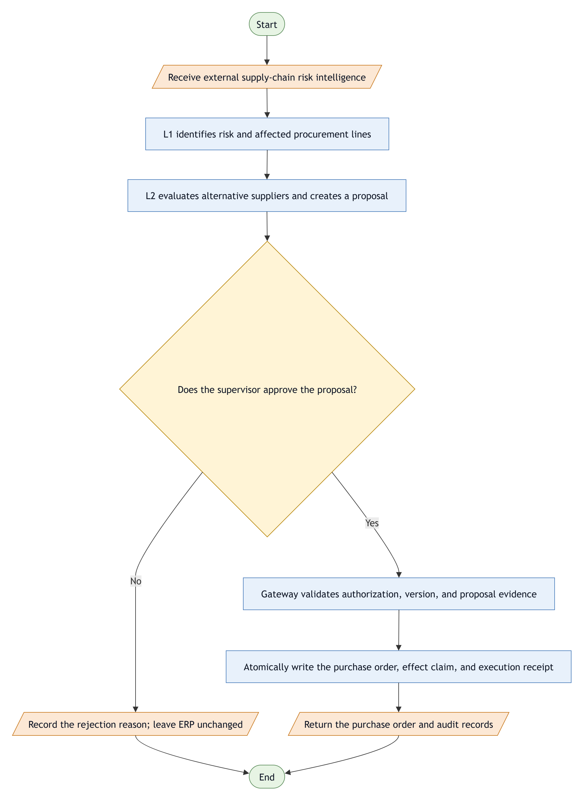
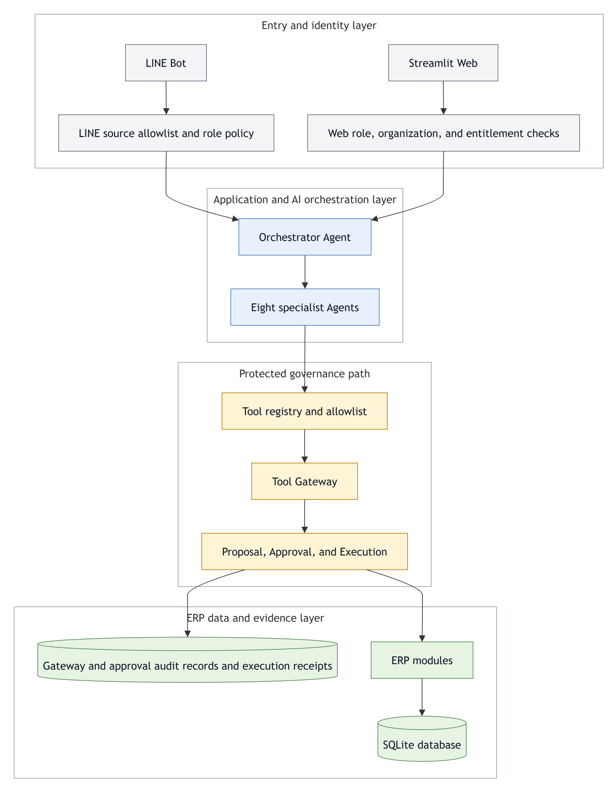

# AI-Risk-Based-Inventory-ERP

[English](README.md) | [繁體中文](README.zh.md)

[](https://github.com/falltwo/AI-Risk-Based-Inventory-ERP/actions/workflows/tests.yml)
[](https://github.com/falltwo/AI-Risk-Based-Inventory-ERP/releases)


> **v1.0 — A governed supply-chain AI decision loop**
> AI makes judgments and proposals; humans retain execution authority. Protected AI/Gateway procurement writes can be approved, replayed, and traced.

This project implements an AI Agent ERP with governance controls. It integrates external supply-chain risk, internal procurement data, AI-assisted proposals, human approval, and ERP execution.

> [!IMPORTANT]
> v1.0 is a competition and research proof of concept. Its deployment boundary is one SQLite database per organization. It does not provide shared-database row-level multi-tenancy, external IAM/SSO, or distributed transactions, and must not be treated as a production identity or authorization service on the public internet.

## Functional tiers

| Tier | Demo account | Provided capabilities | Restrictions |
|---|---|---|---|
| **L1 Risk Observer** | `viewer / viewer` | Risk KPIs, heatmap, alerts, read-only CSV mapping, notification preview | Cannot create proposals or modify ERP data |
| **L2 Intelligence & Decision** | `planner / planner` | Impact analysis, What-if, alternative-supplier comparison, durable Proposal submission | Cannot approve or directly execute ERP writes |
| **L3 Approval & Execution** | `approver / approver` | Review evidence, approve/reject, Gateway execution, audit timeline | Cannot approve its own proposal |

### Procurement decision flow



[Editable draw.io source](docs/diagrams/governed_procurement_flow_en.drawio)

## v0.1 → v1.0

v1.0 builds on the v0.1 governance harness by adding the L1→L2→L3 supply-chain decision workflow and tier-specific interfaces.

| Area | v0.1 — Governance Harness Complete | v1.0 — Governed Decision Loop |
|---|---|---|
| Primary outcome | Closed governance bypasses across Web, LINE, and rollback paths | Connected the governance foundation into a complete L1→L2→L3 product flow |
| AI state disclosure | Code-enforced pending/denied disclosure | Separate Proposal, Approval, and Execution objects keep UI and database state aligned |
| Supply-chain workflow | Intelligence, heatmap, affected records, and recommendations existed as separate capabilities | An affected procurement line can become a governed alternative-purchase Proposal |
| Human approval | Generic write approval with auditable state | L3 reviews source PO, supplier change, quantity, unit price, reason, and digest |
| Execution safety | Gateway, hash-chain logs, and transaction baseline | Exact line/price identity, live revocation checks, one effect per source line, idempotent receipts |
| Product tiers | Governance roles and capabilities | Three accounts with distinct views and least-privilege behavior |
| Automated tests | **56 passing tests** on the public snapshot | **327 passing tests** in v1.0 release verification |
| Documentation | Chinese README and architecture diagrams | Bilingual README, version comparison, documented scope and limitations, and English release notes |

The v0.1 column is based on the initial cleaned snapshot in this public repository. Earlier internal development history is intentionally not linked from public documentation.

## Governance and security design

- **Server-side capability checks:** role, organization membership, and entitlements are reloaded from the database; missing or revoked access fails closed.
- **Separation of duties:** L2 proposes and L3 decides. The original proposer cannot self-approve, even after a role change.
- **Immutable approval evidence:** a canonical payload digest covers effectful fields and binds the source PO line, supplier price row, and operation ID.
- **Atomic execution:** protected purchase approval performs CAS state transition, ERP write, business-effect claim, execution receipt, and terminal status in one SQLite transaction.
- **Idempotent replay:** the same operation returns its existing receipt instead of creating a second purchase order.
- **End-to-end audit:** Proposal, approval, and execution share one operation ID; public UI surfaces expose only redacted summaries.
- **34 governed tools:** 27 `read_only`, 1 `suggestion`, 6 `write`, and 0 `dangerous`; eight specialist Agents receive task-specific allowlists.

## Architecture



[Editable draw.io source](docs/diagrams/system_architecture_en.drawio)

The governance claims above are scoped to the protected AI/Gateway procurement workflow. Existing manual Web ERP forms have role-based access controls, but not every manual write produces a Proposal, Approval, and execution receipt.

## Quick start

### 1. Install

```bash
git clone https://github.com/falltwo/AI-Risk-Based-Inventory-ERP.git
cd AI-Risk-Based-Inventory-ERP

python -m venv .venv
# Windows
.venv\Scripts\activate
# macOS / Linux
# source .venv/bin/activate

pip install -r requirements.txt
```

### 2. Configure a local demo

```bash
cp .env.example .env
```

Set at least:

```dotenv
ERP_DEMO_MODE=true
LLM_MODEL=gemini/gemini-2.5-flash
GEMINI_API_KEY=replace_with_your_key
```

### 3. Run

```bash
streamlit run app.py
```

Known credentials such as `viewer`, `planner`, and `approver` are created and displayed only in Demo Mode. **Use this mode only on localhost; never expose it to the public internet.**

## Key configuration

| Environment variable | Purpose | Default / requirement |
|---|---|---|
| `ERP_DEMO_MODE` | Seeds synthetic data and demo users | `false`; localhost only |
| `ERP_ORGANIZATION_ID` | Binds a SQLite database to one organization | Demo uses `demo-org`; existing non-demo databases must set it and then provision memberships and entitlements |
| `ERP_DB_PATH` | Custom SQLite path | `data/erp.db` |
| `LLM_MODEL` | Primary LiteLLM model | `gemini/gemini-2.5-flash` |
| `LLM_FALLBACK_MODELS` | Comma-separated fallback models | See `.env.example` |
| `LLM_ANALYSIS_MODEL` | Optional model for classification/translation | Primary chain when unset |
| `GEMINI_API_KEY` / `OPENAI_API_KEY` | Provider credentials | Depends on the selected model |
| `GNEWS_API_KEY` | Supply-chain news source | Optional |
| `ERP_SCHEDULER_ACTOR` | Service identity for scheduled risk refresh | Disabled when unset |
| `LINE_CHANNEL_ACCESS_TOKEN` / `LINE_CHANNEL_SECRET` | LINE Bot | Optional |

## Tests and verification

```bash
pip install -r requirements-dev.txt
python -m pytest -q
```

v1.0 local release verification: **327 passed**. CI runs on every pull request.

Coverage includes:

- L1/L2/L3 navigation and negative server-side authorization tests
- Self-approval, revoked access, and cross-organization denial
- Payload, resource-version, source-line, and price tamper rejection
- Concurrent approval, CAS, rollback, and receipt replay
- A single full replacement effect per source procurement line
- Demo seed integrity with no orphan items and stable approved source-line identity across replays

## Repository layout

```text
backend/                     access control, Agents, Gateway, Proposal, ERP, database
frontend/                    Streamlit pages and L1/L2/L3 interfaces
line bot/                    FastAPI + LINE Messaging API
scripts/                     demo seed and operations utilities
tests/                       governance, authorization, transaction, and UI-contract tests
docs/                        architecture diagrams, runbooks, and release notes
```

## Known limitations

- One SQLite database represents one organization; this is not shared-database row-level multi-tenancy.
- Application audit data is tamper-evident, but a host or database administrator can still alter files directly.
- SQLite atomicity does not automatically extend to an external ERP API; cross-system execution still needs outbox, worker, and reconciliation patterns.
- Demo users and synthetic data must not exist in production. Production identity, membership, entitlement, and secret provisioning are deployment responsibilities.
- Upgrading an older non-demo database without an organization boundary fails fast. Set `ERP_ORGANIZATION_ID`, then provision `user_organizations` and `organization_entitlements` before startup.

## Versions

- [v1.0 Releases](https://github.com/falltwo/AI-Risk-Based-Inventory-ERP/releases)
- [v0.1 Release](https://github.com/falltwo/AI-Risk-Based-Inventory-ERP/releases/tag/v0.1)
- [v1.0 English release notes](docs/releases/v1.0.md)
- [v0.1 English release notes](docs/releases/v0.1.md)

Stack: Python 3.11 · Streamlit · SQLite · LiteLLM · FastAPI · LINE Messaging API · Plotly
