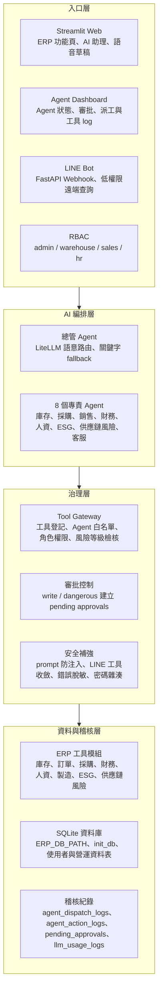
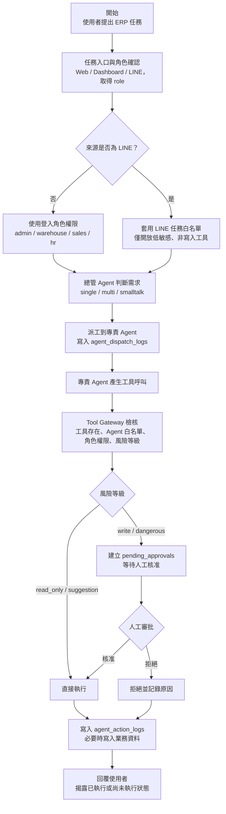
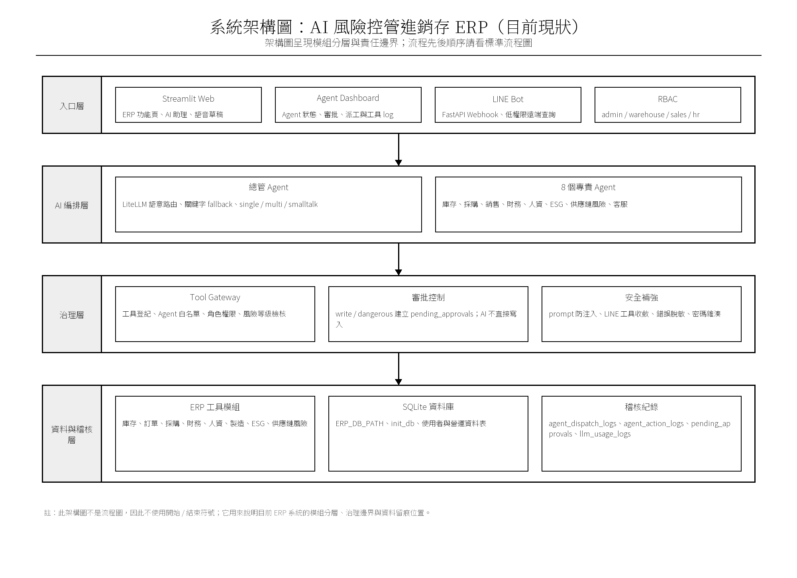
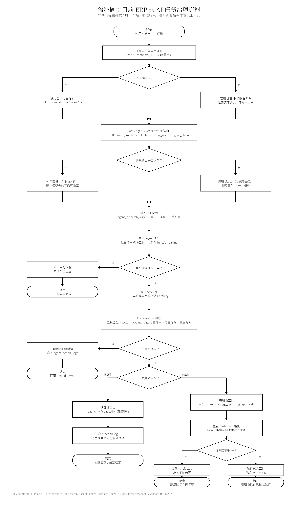

# AI-Risk-Based-Inventory-ERP


**治理優先的 AI Agent 進銷存系統** —— 讓 AI 助理能實際操作 ERP（查庫存、開訂單、評估供應鏈風險），同時把每一個 AI 自主行動納入「可控、可審批、可稽核」的治理鏈。

## 這套系統解決什麼問題

企業導入 AI Agent 最大的顧慮不是能力，是控制：AI 建議可以參考，但讓 AI 直接改庫存、開訂單，誰來把關？出了問題怎麼追？

本系統目前實作一條治理流程：

- Web／LINE Agent 路徑的工具呼叫都會經過 **Tool Gateway**；Web 另檢查 Agent 白名單，LINE 在模型前先縮減工具範圍
- 會改動資料的操作一律**先攔截、送人工審批**，核准後才執行
- 全程寫入**稽核紀錄**（派工決策、工具呼叫、審批流程三層）
- 審批狀態由**程式層保留並揭露** —— 降低模型把 pending 說成 completed 的風險

## 核心特性

| 特性 | 說明 |
|------|------|
| 總管 Agent 派工 | 自然語言任務由 LLM 語意路由到專責 Agent，跨領域任務自動串接多個 Agent 並彙整 |
| 8 個專責 Agent | 庫存、採購、銷售、財務、人資、ESG、供應鏈風險、客服 —— 各自僅持有職責內的工具白名單 |
| Tool Gateway | 32 個登記工具的集中政策入口：檢查工具存在 → Agent 白名單 → 角色權限 → 工具政策分類；尚未以系統級方法證明不存在所有旁路 |
| 四類工具 taxonomy | `read_only` / `suggestion` 直接執行；`write` / `dangerous` 攔截送審批。目前四類只形成兩種執行結果，`dangerous` 工具數為 0 |
| 人工審批流程 | 待審批清單、核准 / 拒絕（附原因）、沖銷與重試，皆於 Dashboard 操作 |
| 三層稽核紀錄 | 派工決策、工具呼叫與審批歷程；目前 requester 主要記錄角色，尚未完成個人層級職責分離 |
| 審批狀態揭露 | 操作被攔下時，回覆由系統層強制附上審批單號與「尚未執行」告示，不依賴 LLM 自律 |
| 多供應商容錯 | LLM 供應商掉線自動依序切換備援模型（LiteLLM，一行設定換模型） |
| 供應鏈風險分析 | 外部新聞情資 → 風險熱圖 → 受影響採購單 → 替代建議 |
| 雙入口 | Web（Streamlit）與 LINE Bot 最終共用 Gateway；LINE 另有來源專用 allowlist，兩個入口的前置控制並不完全相同 |

## 系統架構

### GitHub 可渲染版

**目前系統架構圖**



**AI 任務治理標準流程圖**



### PNG 原圖

**目前系統架構圖**

<details>
<summary>展開架構圖原始 PNG</summary>

<p align="center">
  
</p>

[開啟架構圖原始大圖](docs/images/erp_current_clean_architecture.png)

</details>

**AI 任務治理標準流程圖**

<details>
<summary>展開流程圖原始 PNG</summary>

<p align="center">
  
</p>

[開啟流程圖原始大圖](docs/images/erp_current_standard_flowchart.png)

</details>

### 文字版

```
使用者（Web / LINE）
      │  自然語言任務
      ▼
總管 Agent ─── 語意路由：判斷派給哪個專責 Agent（派工紀錄落庫）
      ▼
8 個專責 Agent ─── 各自僅能使用白名單內的工具
      │  tool call
      ▼
Tool Gateway ─── 白名單 → 角色權限 → 風險分級（呼叫紀錄落庫）
      ├── read_only / suggestion ──→ 直接執行
      └── write / dangerous ──→ 待審批 ──→ 人工核准 ──→ 執行（審批歷程落庫）
      ▼
SQLite（業務資料 + 三層稽核紀錄）
```

**治理邊界**：治理鏈的對象是「AI Agent 的自主行動」。傳統的人工操作表單（手動開單、記帳、維護主檔）由登入者的角色權限（RBAC）管理，操作者本人即決策者，不重複進審批。

## 快速開始

```bash
# 1. 環境（Python 3.11+）
python -m venv .venv
.venv/Scripts/activate        # Windows；macOS/Linux 用 source .venv/bin/activate
pip install -r requirements.txt

# 2. 設定模型（.env）
cp .env.example .env
#    LLM_MODEL=gemini/gemini-2.5-flash   ← 填你的供應商/模型與對應金鑰
#    本機比賽 Demo 才設定 ERP_DEMO_MODE=true（會建立並顯示已知測試帳密）

# 3. 啟動
streamlit run app.py
```

登入後左側選單進入「AI 智能助理」即可用自然語言操作；「Agent Dashboard」檢視派工、稽核與待審批。

當且僅當 `.env` 明確設定 `ERP_DEMO_MODE=true` 時，系統才會建立並顯示測試帳號。此模式只供本機比賽展示，不得用於公開部署。

若某個既有資料庫曾以 Demo 模式初始化，之後把旗標改回 `false` 不會自動刪除帳號；公開或正式部署前必須改用乾淨資料庫，或由管理者移除／輪替所有測試帳密。現階段的 L1/L2/L3 權限模型是單一組織、本機展示邊界，尚未提供多租戶資料列隔離或外部 IAM/SSO，不能直接當成網路服務的正式身分系統。

### LINE Bot（選用）

```bash
# .env 需另設 LINE_CHANNEL_ACCESS_TOKEN / LINE_CHANNEL_SECRET / GEMINI_API_KEY
python "line bot/bot_server.py"    # FastAPI 於 :8000，webhook 需公開網址（如 ngrok）
```

## 設定一覽

| 環境變數 | 用途 | 預設 |
|---------|------|------|
| `ERP_DEMO_MODE` | 建立合成資料與已知 Demo 帳密；僅限本機展示 | `false` |
| `ERP_SCHEDULER_ACTOR` | 背景新聞刷新使用的 ERP 服務身分；未設定時排程停用 | 未設定 |
| `LINE_RICH_MENU_IMAGE_PATH` | 執行 LINE Rich Menu 設定腳本時使用的本機 PNG 路徑 | 未設定 |
| `LLM_MODEL` | 主模型（LiteLLM 格式 `provider/model`），AI 助理與分析頁共用 | `gemini/gemini-2.5-flash` |
| `LLM_FALLBACK_MODELS` | 備援模型（逗號分隔，主模型失敗時依序切換） | `openai/kimi-k2.6,gemini/gemini-2.5-flash` |
| `LLM_ANALYSIS_MODEL` | 分析副任務別名（選填；新聞歸類/翻譯可指到較便宜模型） | 未設＝用主模型鏈 |
| `OPENAI_API_KEY` / `OPENAI_API_BASE` | OpenAI 相容供應商的金鑰與端點 | — |
| `GEMINI_API_KEY` | Gemini 金鑰（選 gemini 系模型時） | — |
| `GNEWS_API_KEY` | 供應鏈新聞來源（選用） | — |
| `ERP_DB_PATH` | 資料庫路徑（企業可指定既有 .db） | `data/erp.db` |
| `LINE_CHANNEL_ACCESS_TOKEN` / `LINE_CHANNEL_SECRET` | LINE Bot 憑證（選用） | — |

若一般（非採購／ERP 交換）寫入在效果完成後、執行收據落庫前中斷，審批會安全停在 `executing`，系統不會自動重試。處理方式見 [Generic approval reconciliation runbook](docs/generic_approval_reconciliation.md)。

## 測試

```bash
pip install -r requirements-dev.txt
python -m pytest tests/ -v
```

測試涵蓋治理關鍵路徑：審批狀態揭露、彙整層治理訊號保留、供應商容錯切換。CI 於每個 PR 自動執行。

## 技術組成

Python 3.11 · Streamlit · SQLite · LiteLLM（多供應商模型層）· FastAPI + LINE Messaging API · Plotly
